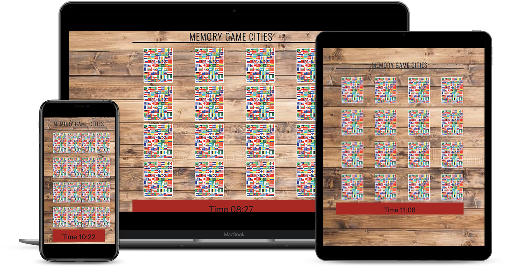

# Interactive Frontend Development Milestone Project

## Memory Game Cities
---

[View the live project here.]( https://adrianaschmit.github.io/Memory-Game-Cities/.) 

Memory Game Cities is a website who offers one fun matching cards game  with 16 cards. It is a fun mental challenge that will test your recall abilities. Suitable for children and adults.

## User Experience (UX)
---

#### As a user I would like to:

- I want to have fun while playing.
- I want a game that properly works as it should.
- I want to be able to access the site from any kind of device.

#### Website goals:

- Offer a 16 cards memory game.
- Offer a game suitable both to children and adults.
- Provide simplicity.

#### Design

- Imagery 
     -  A background image to hold the game. Specific images of cities on one side and a general image on the other side.  

## Features
---

#### Existing Features

- Homepage with the game.
- Responsive on all device sizes.

#### Features Left to Implement

- create a button to restart the game.

## Technologies Used

---

### Languages Used

- [HTML5](https://en.wikipedia.org/wiki/HTML5)
- [CSS3](https://en.wikipedia.org/wiki/CSS)  

- [Javascript]( https://pt.wikipedia.org/wiki/JavaScript)

### Frameworks, Libraries & Programs Used

- [Bootstrap CDN](https://www.bootstrapcdn.com/)
    - Bootstrap CDN was used through adding classes to help the formatting the cards and responsiveness of the game.
- [GoogleFonts](https://fonts.google.com/)   
    - Google fonts was used to import Oswaldo?

- [Git](https://git-scm.com/) 
    - Git was used for version control by committing and pushing the code to GitHub.
- [GitHub](https://github.com/)   
    -  GitHub is being used to store the project.

## Testing
---

The website was tested on a variety of actual devices.

The codes were validated by W3C Markup Validator and W3C CSS Validator Services and Jasmine????

- [W3C Markup Validator](https://validator.w3.org/nu/) 
- [W3C CSS Validator  ](https://jigsaw.w3.org/css-validator/#validate_by_input) 

### Testing User Stories from User Experience (UX) Section

- As a user I would like to:
    - I want to have fun while playing.

        - The imagery and the simplicity of the website provide a fun game.. 
    
    - I want a game that properly works as it should.

        - The game work as supposed.

    - I want to be able to access the site from any kind of device.

        - The website is responsive on most of the device.

   
        
          

## Deployment
---

1. Log in to GitHub and locate the [GitHub Repository](https://github.com/AdrianaSchmit/curly-queen)
2. At the top of the Repository (not top of page), locate the "Settings" Button on the menu
3. Scroll down the Settings page until you locate the "GitHub Pages" Section.
4. Under "Source", click the dropdown called "None" and select "Master Branch".
5. The page will automatically refresh.
6. Scroll back down through the page to locate the now published site [link]( https://adrianaschmit.github.io/curly-queen/)  in the "GitHub Pages" section.

#### Making a Local Clone

1. Log in to GitHub and locate the [GitHub Repository](https://github.com/AdrianaSchmit/curly-queen).
2. Under the repository name, by the left side of the green Gitpod button click in Code.
3. To clone the repository using HTTPS, under "Clone with HTTPS", copy the link.
4. Open Git Bash
5. Change the current working directory to the location where you want the cloned directory to be made.
6. Type git clone, and then paste the URL you copied in Step 3.
7. Press Enter. Your local clone will be created.

## Credits
---

#### Content

-  The content was written by the developer.

- [Bootstrap4](https://getbootstrap.com/docs/4.4/getting-started/introduction/) were used throughout the project for responsiveness.

- The text for the Deployment section was copied from the [CodeInstituteSampleRead.me](https://github.com/Code-Institute-Solutions/SampleREADME). 

#### Media

- The images in this website were copied from google images.

#### Acknowledgements

- Great thanks to Adam Brhani to guide me with his full stack experience in this project.
